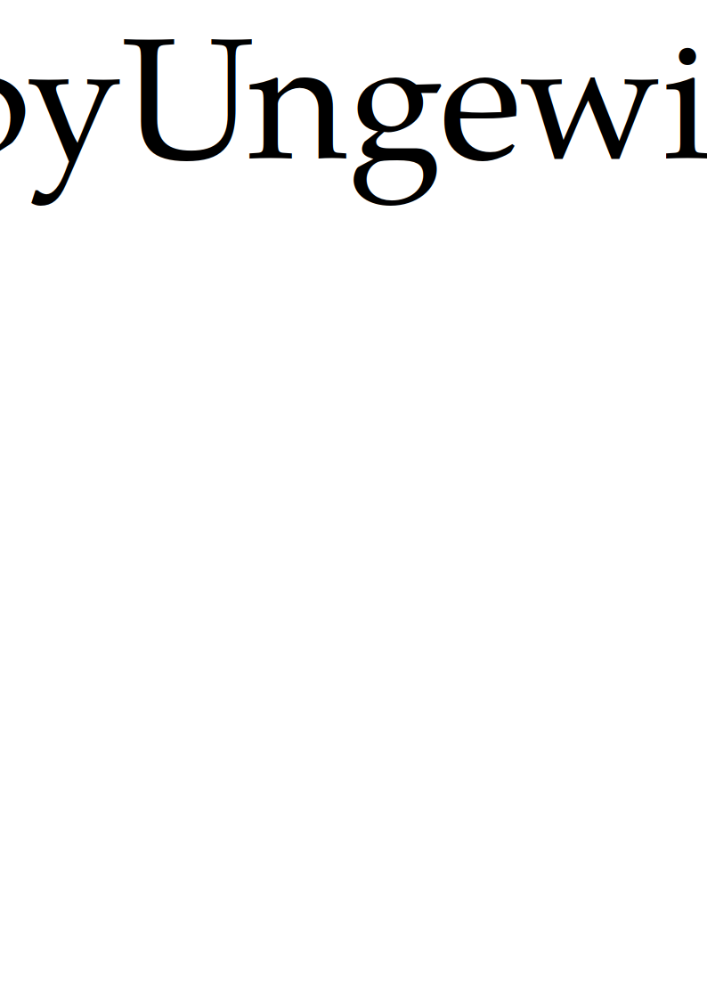

<p align=center></p>

# pyUngewiss

**Python librarY for Uncertainty aNalysis in liGhtwEight desiGn with IntervalS and fuzzy numberS**

**Python-Bibliothek zur Unsicherheitsanalyse im Leichtbau mit Intervallen und unscharfen Zahlen**

**Libreria Python per l'analisi dell'incertezza nella costruzione leggera con intervalli e numeri sfocati**

## Installation
### Prerequisites
Python 3 and you can install the necessary libraries via PIP:
```
pip install scipy
pip install numpy
pip install matplotlib
pip install pygmo
pip install cma
```
Further, for the use of gradient-based optimizers, you will need the package pyOpt.
```
svn checkout http://svn.pyopt.org/trunk pyopt
cd pyopt
python setup.py install
```
For details see www.pyopt.org

Note to PyGMO: the PIP installation is currently not working. Therefore PaGMO and then PyGMO must be compiled to use the algorithms in that package. 

### Install
```
python setup.py install
```

### PIP
You can also install pyUngewiss via PIP
```
pip install pyUngewiss
```

## Getting started
See iPython notebooks and Python files under examples.

Set up uncertain function with uncertain parameters and further parameters as input:
```Python
def Eigenfrequence1DoF(p, x):
    m = p[0]
    k = p[1]
    omega0 = np.sqrt(k/m)
    f0 = omega0/2/np.pi
    return(f0)
```

Then define the uncertain parameters -- here as intervals -- and combine in one list:
```Python
m = pu.UncertainNumber([2., 2.5])
k = pu.UncertainNumber([40000, 60000])
pUnc = [m, k]
```

Initialize the uncertain problem and set parameter options:
```Python
Prob = pu.UncertainAnalysis(Eigenfrequence1DoF, pUnc)
Prob.deltax = 1e-3
Prob.epsStop = 1e-3
```

Calculate:
```Python
Prob.calculate()
```
Print and plot results:
```Python
m.printValue()
k.printValue()
plt, _ = pu.plotIntervals([m.Value, k.Value],
                 labels=["mass $m$ [kg]", "stiffness $k$ [N/mm]"])
plt.show()
```

## Author
E. J. Wehrle
